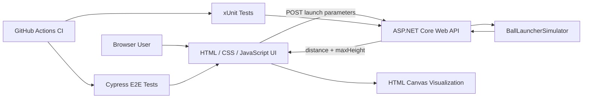

# Interactive Ball Launcher Simulator

[](https://github.com/javeriaz15/Interactive-Ball-Launcher/actions/workflows/ci.yml)

A browser-based ball-launch simulation application built with an **ASP.NET Core Web API**, **JavaScript**, **HTML Canvas**, and automated testing with **Cypress** and **xUnit**.

The simulator accepts launch parameters, calculates launch distance and maximum height through the backend API, and visualizes the resulting trajectory in the browser.

## Highlights

- ASP.NET Core REST API for launch calculations
- Interactive browser UI built with vanilla JavaScript, HTML, and CSS
- HTML Canvas trajectory visualization and animation
- Input validation and API error handling
- Cypress end-to-end browser automation
- xUnit backend unit and controller tests
- Automated build and regression testing with GitHub Actions
- Headless Chrome E2E execution in CI

## Architecture



## Technology Stack

| Area | Technology |
|---|---|
| Backend | C# · ASP.NET Core · .NET 8 |
| Frontend | JavaScript · HTML · CSS |
| Visualization | HTML Canvas |
| API | REST / JSON |
| Backend Testing | xUnit |
| E2E Testing | Cypress 15 |
| Browser Automation | Chrome / Cypress |
| CI | GitHub Actions |

## Project Structure

```text
Interactive-Ball-Launcher/
│
├── .github/
│   └── workflows/
│       └── ci.yml
│
├── BallLauncherBackend/
│   ├── Controllers/
│   │   └── BallLauncherController.cs
│   ├── BallLauncherTests/
│   │   ├── BallLauncherControllerTests.cs
│   │   ├── BallLauncherSimulatorTests.cs
│   │   └── BallLauncherTests.csproj
│   ├── Properties/
│   ├── BallLauncherApi.csproj
│   ├── BallLauncherApi.sln
│   ├── BallLauncherSimulator.cs
│   ├── Program.cs
│   └── appsettings.json
│
├── BallLauncherFrontend/
│   ├── cypress/
│   │   ├── e2e/
│   │   │   └── test_ball_launcher_spec.cy.js
│   │   └── support/
│   │       └── e2e.js
│   ├── cypress.config.js
│   ├── index.html
│   ├── package.json
│   └── package-lock.json
│
├── .gitignore
└── README.md
```

## Application Flow

The user enters:

- Starting angle
- Motor torque
- Ball release angle
- Ball weight
- Simulation speed

When **Simulate** is selected, the frontend sends the launch parameters to:

```http
POST /BallLauncher/calculateLaunchDistance
```

The ASP.NET Core API validates the parameters, performs the launch calculation, and returns values including:

```json
{
  "distance": 40.816327,
  "maxHeight": 10.204082
}
```

The frontend then displays the launch distance and animates the trajectory using HTML Canvas.

## Automated Testing

The repository contains automated tests at both the backend and browser levels.

### Backend — xUnit

The backend test suite covers:

- Expected calculation results for valid inputs
- Invalid ball weight
- Invalid motor torque
- Release-angle boundaries
- Controller success responses
- Controller `400 Bad Request` behavior

The current backend suite executes **12 test cases**.

Run it with:

```bash
dotnet test ./BallLauncherBackend/BallLauncherTests/BallLauncherTests.csproj
```

### Frontend — Cypress

The Cypress E2E suite runs against the real frontend and ASP.NET Core API rather than replacing the API with mocked responses.

Coverage includes:

- Successful launch simulation
- API response validation
- Invalid motor torque
- Reset behavior
- Small positive values
- Larger valid values
- Fractional values
- Release-angle boundaries
- Simulation-speed UI behavior

The current E2E suite contains **8 tests**.

Run it with:

```bash
cd BallLauncherFrontend
npm run test:e2e
```

> The frontend and backend servers must both be running when executing the local E2E suite.

## Continuous Integration

GitHub Actions automatically validates the application on pushes and pull requests to `main`.

The CI workflow:

1. Checks out the repository
2. Configures .NET 8
3. Restores backend dependencies
4. Builds the ASP.NET Core application
5. Runs the xUnit backend tests
6. Configures Node.js
7. Installs frontend dependencies
8. Starts the backend API
9. Starts the frontend server
10. Launches Chrome in headless mode
11. Runs the Cypress E2E regression suite

This ensures both backend tests and browser-level application behavior are validated automatically.

## Running Locally

### Prerequisites

Install:

- .NET 8 SDK
- Node.js
- npm
- Python 3 for serving the static frontend
- Google Chrome for local Cypress Chrome runs

Clone the repository:

```bash
git clone https://github.com/javeriaz15/Interactive-Ball-Launcher.git
cd Interactive-Ball-Launcher
```

### 1. Start the backend

From the repository root:

```bash
dotnet restore ./BallLauncherBackend/BallLauncherApi.sln
dotnet run --project ./BallLauncherBackend/BallLauncherApi.csproj
```

The API runs locally on:

```text
http://localhost:5293
```

### 2. Install frontend dependencies

In a second terminal:

```bash
cd BallLauncherFrontend
npm install
```

### 3. Start the frontend

On Windows:

```bash
py -m http.server 3000
```

On macOS/Linux:

```bash
python3 -m http.server 3000
```

Open:

```text
http://localhost:3000
```

### 4. Run Cypress

With both servers still running:

```bash
cd BallLauncherFrontend
npm run test:e2e
```

For interactive Cypress mode:

```bash
npm run cy:open
```

## CI vs. Local Testing

The local workflow and CI exercise the same application layers:

```text
Browser
   ↓
JavaScript frontend
   ↓
ASP.NET Core REST API
   ↓
BallLauncherSimulator
```

GitHub Actions additionally provisions the environment automatically and executes the Cypress suite using headless Chrome.

## Current Simulation Limitations

This project is a software simulation rather than a complete physical model.

The current implementation has several known limitations:

- The backend launch calculation is primarily driven by the ball release angle and configured motor speed.
- Motor torque and ball weight participate in intermediate calculations but currently cancel mathematically in the resulting launch velocity.
- Starting angle influences the browser visualization but is not currently incorporated into the backend launch-distance calculation.
- Air resistance, spin, aerodynamic drag, and environmental effects are not modeled.

These limitations are intentionally documented rather than hidden behind tests that imply greater physical accuracy.

## Modernization Work

The original simulator functionality has been preserved while the repository has been incrementally improved for software-engineering and QA quality.

Modernization work includes:

- Removing generated and obsolete repository files
- Separating production and test project dependencies
- Expanding xUnit backend and controller coverage
- Improving Cypress assertions and synchronization
- Removing fixed test delays and duplicate E2E scenarios
- Migrating Cypress to the current major version
- Resolving npm dependency vulnerabilities
- Removing obsolete Cypress scaffolding
- Adding GitHub Actions continuous integration
- Running browser-level regression tests automatically in headless Chrome

## Future Improvements

Potential extensions include:

- Improve the physics model so torque, weight, and starting angle materially affect the launch calculation
- Add air resistance and ball spin
- Add additional API integration tests
- Add dynamic velocity and acceleration visualization
- Expand the Canvas visualization or migrate to WebGL / Three.js
- Package the application for easier deployment
- Add an optional hosted demonstration environment

## Author

**Juwairiah Zia**

Computer Vision & Applied AI Engineer with experience across software engineering, AI/ML systems, testing, APIs, cloud applications, and production-oriented technical delivery.